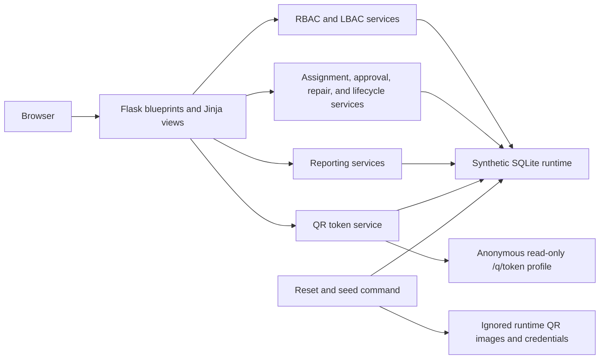

# Architecture

## Components

## Application Boundaries

- `itams/routes/` contains Flask blueprints and request handling.
- `itams/services/` contains permissions, access scoping, workflows, reporting, QR, uploads, audit, and seeding logic.
- `itams/models.py` defines relational entities and history records.
- `itams/templates/` and `itams/static/` provide the server-rendered interface.
- `sample_data/` and the root reset scripts provide repeatable local sample data.
- `tools/` contains release verification and the recursive public-content audit.
- `.runtime/` is the sole mutable application area and is excluded from version control.

## Authenticated Request Flow

1. Flask authenticates the session and resolves the assigned role.
2. Permission checks decide whether the operation is available.
3. LBAC adds the user's allowed locations to database queries.
4. A workflow service validates state transitions and approval requirements.
5. SQLAlchemy commits the change and related history or audit rows together.
6. Jinja renders only actions permitted for the current role.

## Public QR Request Flow

1. A QR supplies a random token rather than a sequential database identifier.
2. The public blueprint resolves an active asset or infrastructure token.
3. The route constructs a dedicated allow-listed view model.
4. A standalone read-only template renders safe fields without an authenticated session.

The public route does not reuse the authenticated profile template, reducing the chance that internal fields or controls leak through a future UI change.

## Data Reset Flow

The reset command verifies that its target is the project-local `.runtime` directory, removes that runtime only, initializes a new schema, inserts repeatable sample records, creates random QR tokens, generates QR images, and writes local credentials to ignored storage.

## Security Boundaries

- A fixed safe-mode boundary disables high-risk recovery and deployment operations.
- CSRF, session protections, login throttling, upload validation, and response headers provide layered controls.
- The public release audit treats unexpected databases, archives, documents, keys, environment files, organization identifiers, contact data, network values, and concrete secrets as failures.
